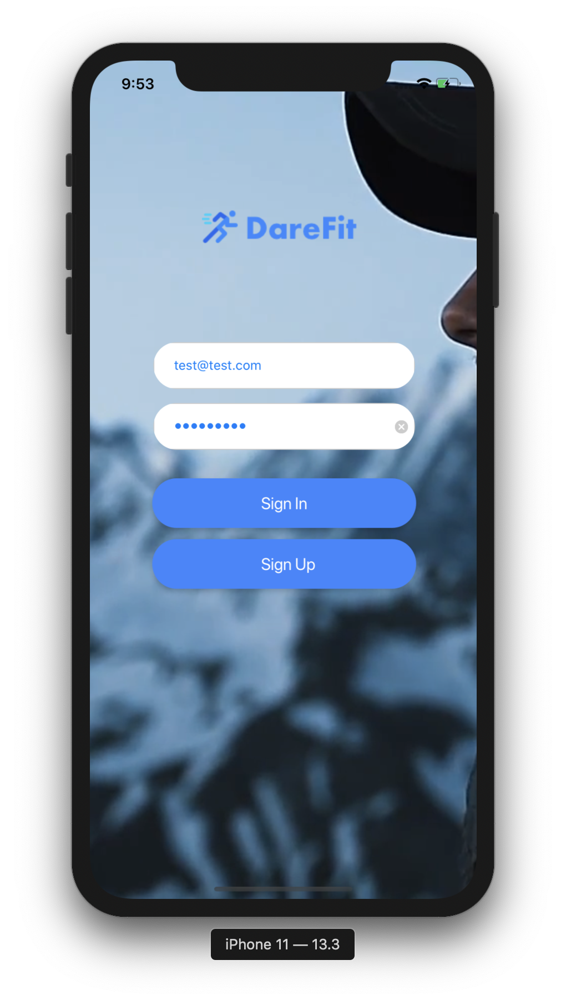

# DareFit
DareFit is an application that allows users to create and join sports challenges. After signing up on the application, users have the ability to create either running, cycling or swimming challenges and post it on their location so that other users can join this challenge. 

The application consists of 6 view controllers:

- Sign In View Controller which gives users the ability to sign into the application using their credentials.

  

- Sign Up View Controller which gives users the ability to sign up.

  

- Create Challenges View Controller which gives users the ability to select and create any of the 3 available challenges.

  

- Creat Challenges Details View Controller which allows users to enter the description of their posted challenge.

  

- Join Challenges View Controller which shows a map view of all available challenges so that users can join them.

  

- Join Challenges Data View Controller which shows more description about the selected challenge and gives users the abiltiy to contact the person who posted the challenge by clicking on the "Contact" button which redirects them into the website of the person who posted the challenge.

  

DareFit uitilizes Apple MapKit, Firebase Authentication and Firebase Firestore Database to povide these features. The Application UI was designed using Adobe XD.
